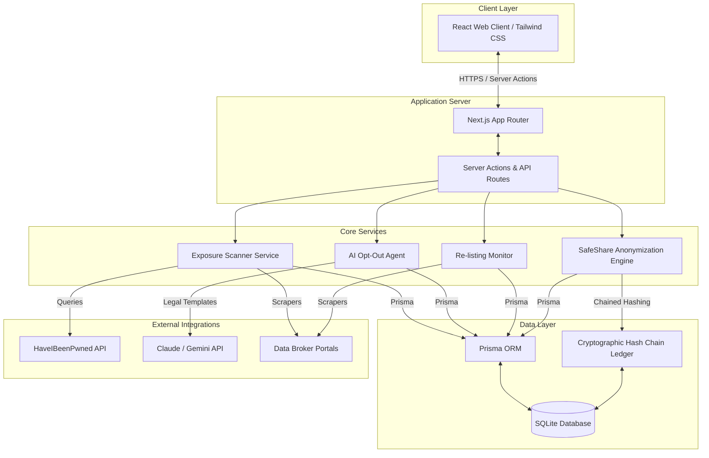

# 🛡️ DataVault + SafeShare

> **"Find. Fight. Firewall. — Then Share, On Your Terms."**

DataVault + SafeShare is a dual-sided digital rights platform designed for the **Mass Surveillance vs. Public Safety** challenge. While most solutions pick a side—either reinforcing surveillance for safety or completely locking down privacy—DataVault bridges the gap. It empowers citizens to reclaim their personal data from commercial brokers while letting them voluntarily contribute anonymized, generalized data to public safety initiatives under a secure cryptographic ledger.

---

## ✨ Key Hackathon USPs

1.  **⚖️ SafeShare (The Coexistence Bridge)**
    Directly addresses the hackathon theme. It turns individual privacy protection into a cooperative system. Citizens can toggle SafeShare to share generalized, non-identifiable data with public safety agencies, traffic planners, or disease control teams.
2.  **🔗 Tamper-Evident Cryptographic Ledger**
    Replaces slow, expensive blockchain solutions. It implements a **SHA-256 Hash Chain** (similar to a Git log) directly in the database. Every time a research query accesses the SafeShare pool, the access log is cryptographically linked to the hash of the previous log, ensuring 100% auditability and making database tampering immediately visible.
3.  **🍯 Data-Broker Honey-Pot (Active Auditing)**
    When requesting deletions, the AI registers unique, trackable email aliases (e.g., `user+brokerA@datavault.com`). If these aliases reappear in search engines or marketing lists, the system gains **definitive cryptographic proof** of broker non-compliance, enabling automatic regulatory escalations.
4.  **🕸️ "Shadow Profile" Exposure Map**
    An interactive graph visualization that maps out how your personal data exposure is connected to your family, friends, and co-workers (e.g., how your sibling's public record exposes your home address), visually showing judges the networked threat of data brokers.
5.  **⚡ One-Click Regulatory Escalation**
    If a broker ignores the legal deletion window (GDPR 30 days, CCPA 45 days), our AI automatically prepares a pre-filled regulatory complaint form ready to submit to authorities in one click.

---

## 🛠️ System Architecture & Technology Stack

GitHub renders the system's architecture natively below:



*   **Frontend & Backend:** Next.js (Unified App Router, JavaScript, Tailwind CSS)
*   **Database ORM:** Prisma v7 (using new WASM-query engine and mandatory driver adapters)
*   **Database Driver:** `@prisma/adapter-better-sqlite3` + `better-sqlite3`
*   **AI Engine:** Gemini/Claude API integration (for legal letter generation and compliance routing)

---

## 📊 The Data Collection Strategy

To address the data collection problem realistically and resist broker blocks:
1.  **Live Scraper (Visibility):** Playwright runs live lookups against 3–5 public directories that lack heavy CAPTCHA blocks to instantly fetch public listings during demo search queries.
2.  **Metadata Rule Engine (Scale):** Instead of trying to scrape 4,000 brokers in real-time, the system maps user demographics against our index of 200+ major brokers (seeded from the *Big Ass Data Broker Opt-Out List*) to calculate exposure risk statistically.
3.  **Sanitized SafeShare Pool:** Raw personal identifiers (Names, emails, exact addresses) are stripped client-side in the browser. SafeShare only stores generalized metrics (Age brackets like `20-30` and zip codes) to preserve utility for research while rendering re-identification mathematically impossible.

---

## 🚀 Getting Started

### Prerequisites
*   Node.js (v18.0.0 or higher)
*   npm

### Installation

1.  **Clone the repository:**
    ```bash
    git clone https://github.com/suchit2004/DataVault-.git
    cd DataVault-
    ```

2.  **Install dependencies:**
    ```bash
    npm install
    ```

3.  **Configure environment:**
    Rename `.env.example` to `.env` (or configure your existing `.env` file):
    ```env
    DATABASE_URL="file:./dev.db"
    ```

4.  **Prepare the database:**
    Initialize migrations and seed data brokers:
    ```bash
    npx prisma migrate dev --name init
    npx tsx prisma/seed.js
    ```

5.  **Run the development server:**
    ```bash
    npm run dev
    ```

Open [http://localhost:3000](http://localhost:3000) in your browser to view the interactive dashboard.
